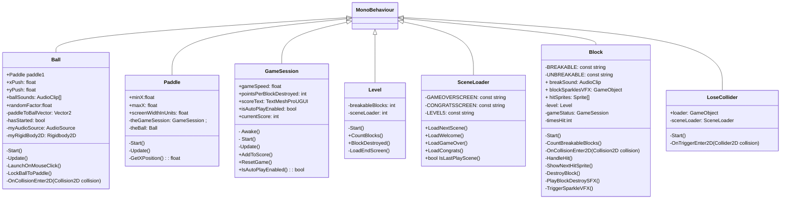

# 07-DebugBlockbreaker-dhagenauer

```mermaid
classDiagram
    MonoBehaviour <|-- Ball
    MonoBehaviour <|-- Paddle
    MonoBehaviour <|-- GameSession
    MonoBehaviour <|-- Level
    MonoBehaviour <|-- SceneLoader
    MonoBehaviour <|-- Block
 MonoBehaviour <|-- LoseCollider

  

    class Ball{
    +Paddle paddle1
    +xPush: float 
    +yPush: float 
    +ballSounds: AudioClip[] 
    +randomFactor:float 
    -paddleToBallVector: Vector2 
    -hasStarted: bool
    -myAudioSource: AudioSource
    -myRigidBody2D: Rigidbody2D
    -Start()
    -Update()
  

    -LaunchOnMouseClick()
 

    -LockBallToPaddle()
  

    -OnCollisionEnter2D(Collision2D collision)
  
    }
    class Paddle{

    
    +minX:float 
    +maxX: float
    +screenWidthInUnits: float 
    -theGameSession: GameSession ;
    -theBall: Ball


	-Start ()
   
	-Update ()

    -GetXPosition(): float 
    
}
 class GameSession {

    +gameSpeed: float 
    +pointsPerBlockDestroyed: int 
    +scoreText: TextMeshProUGUI 
    +isAutoPlayEnabled: bool 

    
    +currentScore: int 

    - Awake()
   

    - Start()
  

    -Update () 
    

    +AddToScore()
   

    +ResetGame()
   

    +IsAutoPlayEnabled(): bool 
   
}
class Level{

    -breakableBlocks: int 

    -sceneLoader: int 

    -Start()
   

    +CountBlocks()
   

    +BlockDestroyed()
   
    -LoadEndScreen()
   
}
class LoseCollider {
    +loader: GameObject 
    -sceneLoader: SceneLoader

    -Start ()
   

    -OnTriggerEnter2D (Collider2D collision)
    
}
class SceneLoader{

    
    -GAMEOVERSCREEN: const string
    -CONGRATSSCREEN: const string
    -LEVEL5: const string

    +LoadNextScene()
    

    +LoadWelcome()
   

    +LoadGameOver()
   

    +LoadCongrats()
    

    +bool IsLastPlayScene()
}
class Block{

    
    -BREAKABLE: const string
    -UNBREAKABLE: const string 

    + breakSound: AudioClip 
    + blockSparklesVFX: GameObject 
    + hitSprites: Sprite[] 

    -level: Level 
    -gameStatus: GameSession 

    -timesHit:int 

    -Start()
 
    -CountBreakableBlocks()
  
    -OnCollisionEnter2D(Collision2D collision)
  
    -HandleHit()
    
    -ShowNextHitSprite()
    
    -DestroyBlock()
   
    -PlayBlockDestroySFX()
  
    -TriggerSparkleVFX()
 
}
```
